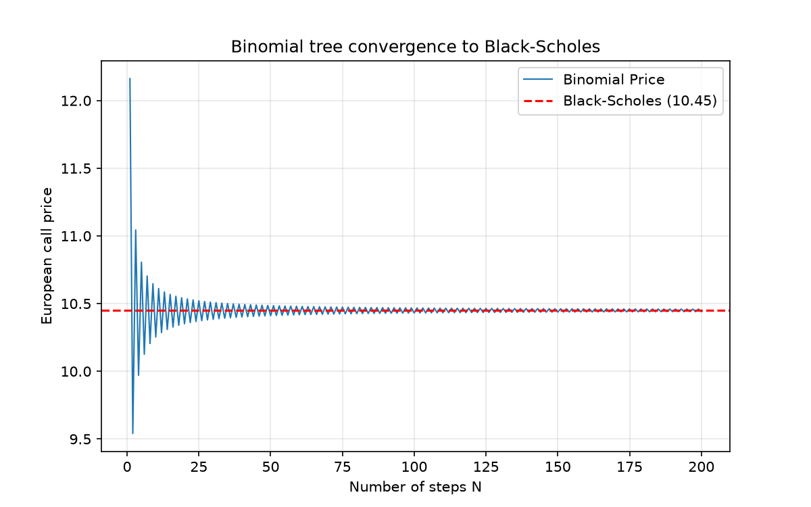

# Binomial Option Pricing Model

## Overview

This project implements a binomial options pricing model. The stock price is modelled over discrete time steps, with a fixed probability of moving up or down at each step. The option price is then computed by working backwards from the possible payoffs at maturity. The binomial tree is a discrete-time alternative to the Black-Scholes formula. Unlike Black-Scholes, it can price American options and other contracts without closed-form solutions.

## What's implemented

- European call and put prices via the CRR binomial tree.
- American options, with early exercise evaluated at each node.
- Convergence study against the Black-Scholes closed-form price.
- Continuous dividend yield, including dividend-adjusted risk-neutral probabilities and European/American option pricing.
- A pytest suite covering the tree, the pricing recursion, and
  the American-vs-European relationships.

## Plan

- [x] Stage 0: initialise repository with structure
- [x] Stage 1: Tree with European call
- [x] Stage 2: European put and put-call parity
- [x] Stage 3: Convergence study
- [x] Stage 4: American options
- [x] Stage 5: Continuous dividend yield
- [ ] Stage 6: Trinomial tree

## Convergence

The Cox-Ross-Rubinstein (CRR) tree converges to the Black-Scholes price as the number of time steps increases. For the standard test case ($S=100$, $K=100$, $T=1$, $r=0.05$, $\sigma=0.2$), the tree price approaches $10.45$. 

The convergence is not monotone: the price oscillates around the Black-Scholes value, with the amplitude decreasing at rate $O(1/N)$ (Leisen & Reimer, 1996).

## American options

Unlike the Black-Scholes formula, the binomial tree can price American options, which can be exercised at any time before expiry. The backward recursion visits each node with knowledge of the stock price at that node, so it can compare holding the option to immediate exercise.

At each non-terminal node, the option value is

$$
V = \max\left(\text{continuation value}, \text{intrinsic value}\right)
$$

where the continuation value is the discounted expected value of the next two nodes (the same as a European option) and the intrinsic value is the value if exercised immediately, $S - K$ for a call or $K - S$ for a put. At expiry, the option is worth its intrinsic value.

For a non-dividend-paying stock, two results hold:
- **American calls equal European calls.** Exercising early means paying the strike sooner and giving up the interest that could have been earned on it, without gaining anything in return.

**American puts are worth at least as much as European puts.** When early exercise is optimal, the American put has a positive early-exercise premium.

For the standard test case, the American call price matches the European call at $10.45$, while the American put exceeds the European put: at $N = 1000$ the American put is $6.09$ against a European put of $5.57$.

## Continuous dividend yield

The model supports a continuous dividend yield $q$.

Under the risk-neutral measure, the stock price has expected capital-growth
rate

$$
r - q,
$$

since the dividend yield $q$ forms part of the stock's total return.
The CRR risk-neutral probability therefore becomes

$$
p = \frac{e^{(r-q)\Delta t} - d}{u-d}.
$$

For European options, the tree is validated against the dividend-adjusted
Black-Scholes formulas:

$$
C = S_0 e^{-qT} N(d_1) - K e^{-rT} N(d_2).
$$

$$
P = K e^{-rT} N(-d_2) - S_0 e^{-qT} N(-d_1). $$

The implementation also satisfies dividend-adjusted put-call parity,

$$
C - P = S_0 e^{-qT} - K e^{-rT}.
$$

Increasing the dividend yield lowers the value of European calls and raises
the value of European puts, all else being equal.

Dividends also change the early-exercise behaviour of American calls. For a
non-dividend-paying stock, an American call has the same value as the
corresponding European call. With a sufficiently high dividend yield, early
exercise can become optimal and the American call can therefore be worth more.

## Usage

    pip install -r requirements.txt
    python binomial_tree.py

## Tests

    python -m pytest -v

The suite validates:

- The CRR invariant $u \cdot d = 1$.
- The risk-neutral martingale property.
- European calls and puts against known values and Black-Scholes.
- Put-call parity for European options.
- American calls equal European calls for a non-dividend-paying stock; American puts exceed European puts.
- Dividend-adjusted risk-neutral growth.
- European call and put convergence to dividend-adjusted Black-Scholes.
- Dividend-adjusted put-call parity.
- The effect of dividends on European call and put values.
- American call early-exercise behaviour with and without dividends.

## Project structure

    binomial-tree/
    ├── binomial_tree.py          # tree pricing, convergence plot
    ├── tests/
    │   └── test_binomial_tree.py
    ├── requirements.txt
    ├── README.md
    ├── .gitignore
    └── output/                   # generated plots

## References

- Leisen, D. P. J., & Reimer, M. (1996). Binomial models for option valuation — examining and improving convergence. *Applied Mathematical Finance*, 3(4), 319–346.